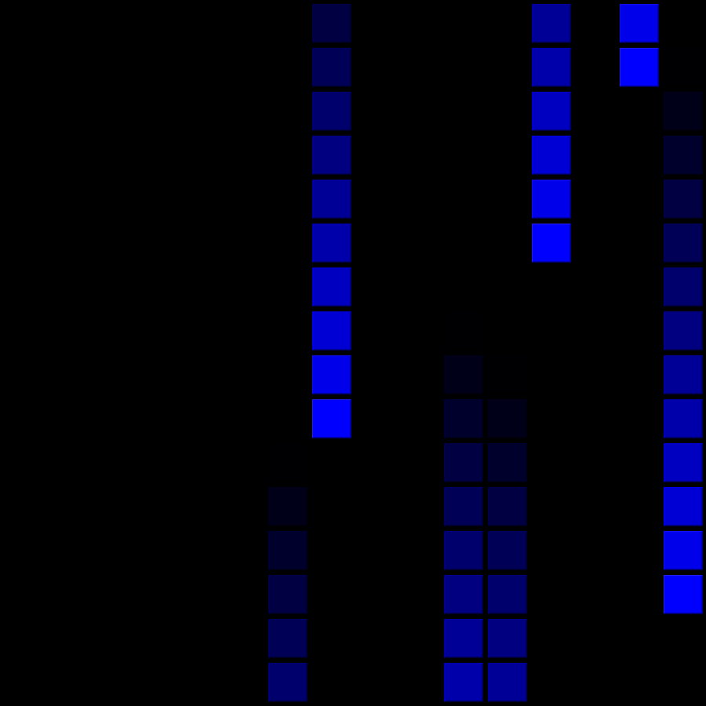
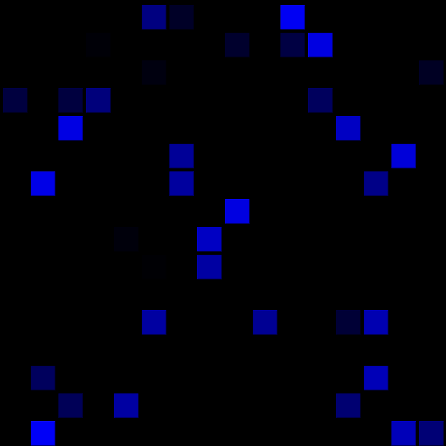
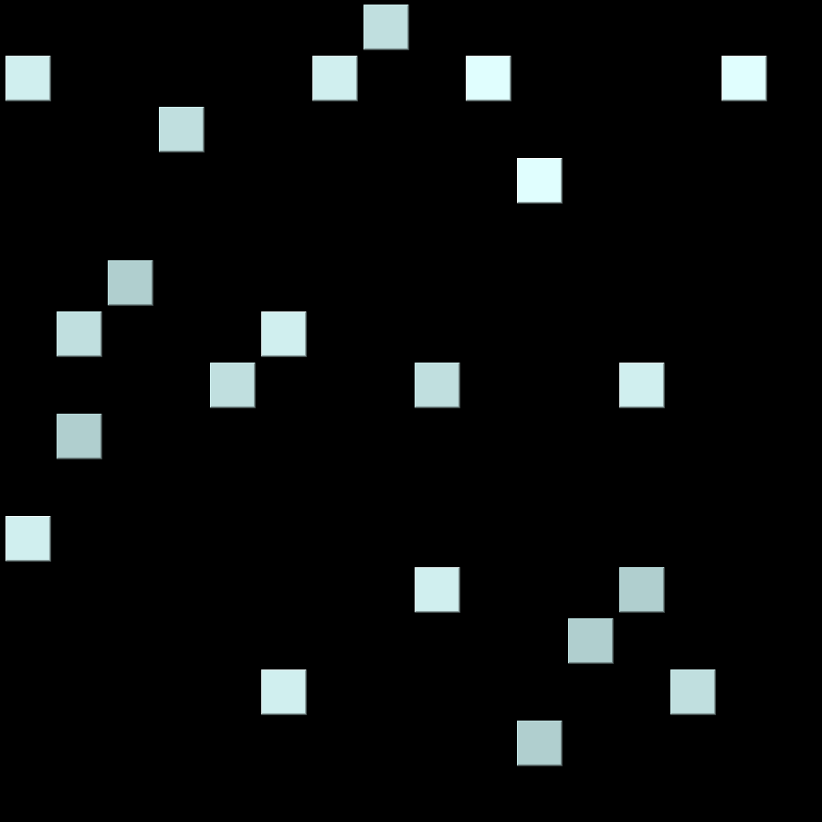
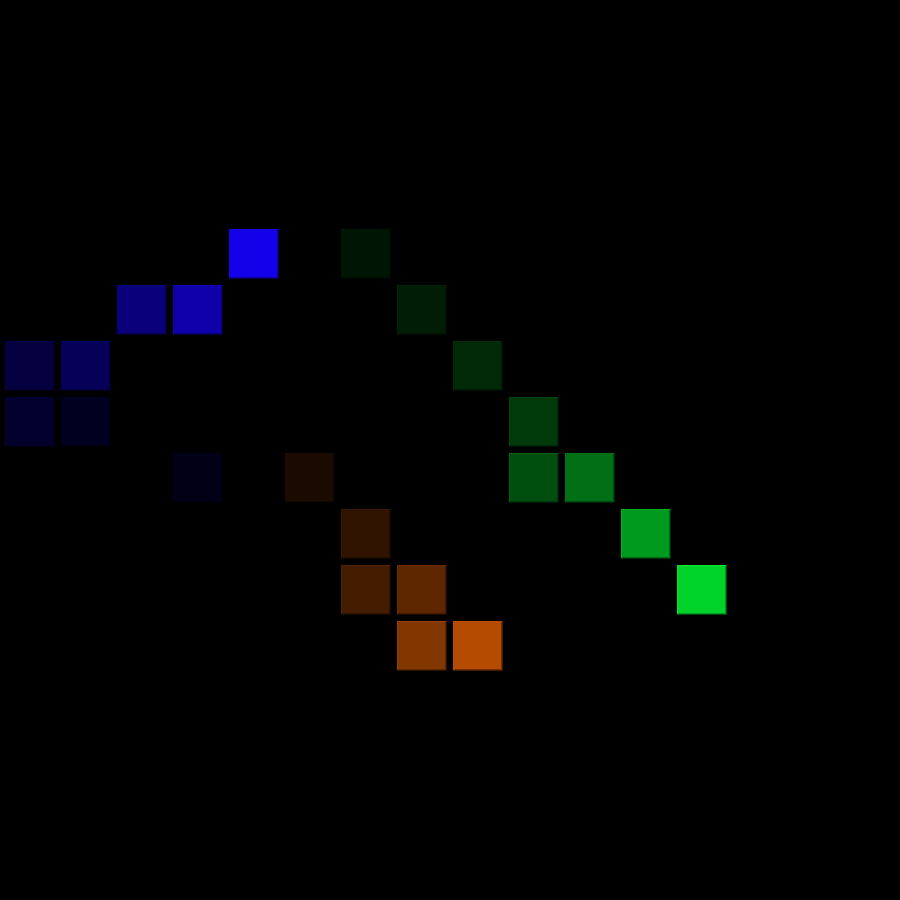
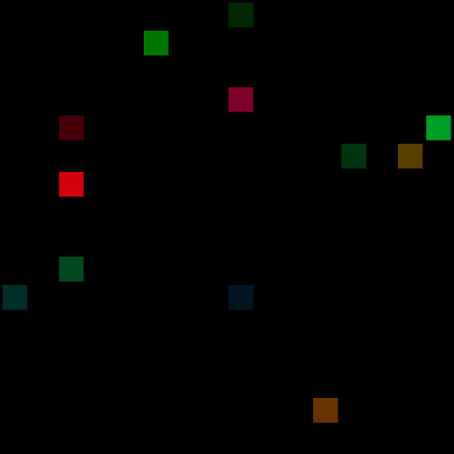
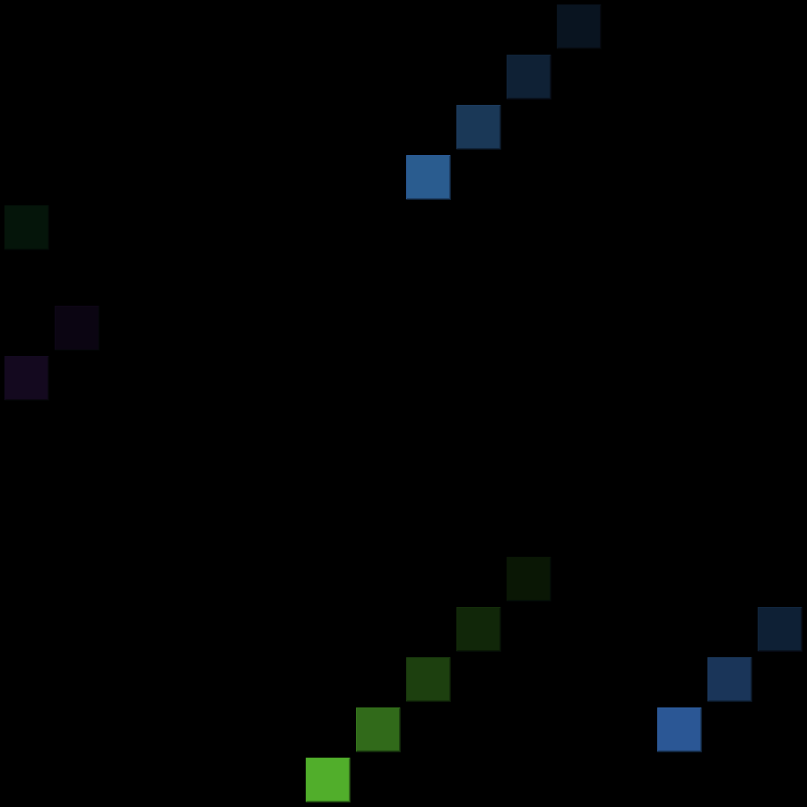
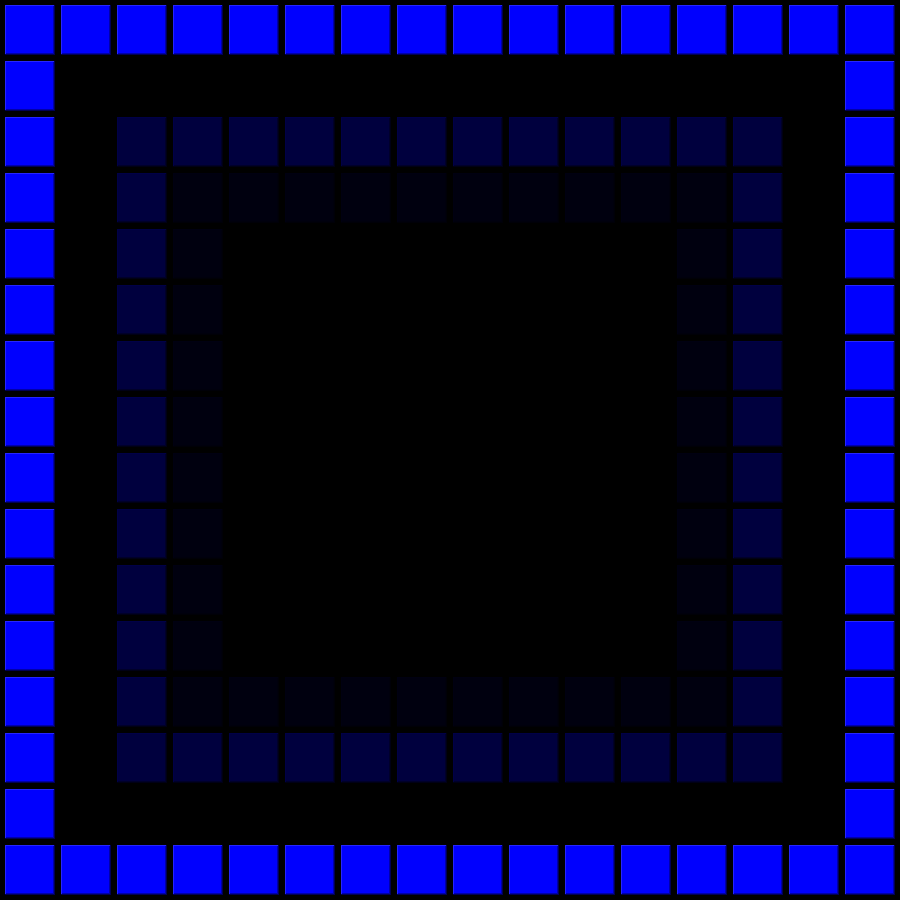

# LedMatrix
LedMatrix based on ws2812b/ws2811 leds and esp8266 microchip

# Примеры работы режимов:

**00_slow_random:**

**01_simple_rainbow:**

**02_dribs:**

**03_rain:**

**04_all_random:**

**05_snow:**

**06_fire:**

**07_the_matrix:**

**08_simple_balls:**

**09_confetti:**

**10_starfall:**

**11_dynamic_square:**

**12_random_rain:**

**13_rainbow_rain:**

**14_points:**

**15_rainbow_point:**

**16_rainbow_static_point:**

